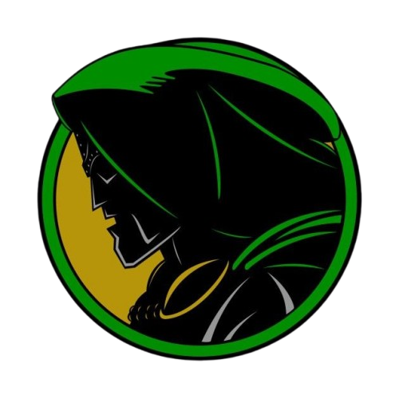

<div align="center">



# DOOMSDAY PROTOCOL // LATVERIAN ARCHIVES 

[](https://git.io/typing-svg)

<!-- Live Dynamic Countdown SVG (Target: Dec 18, 2026) -->


<br>

[](https://doomsdayprotocol.vercel.app/)
[](https://github.com/mhdhamka/doomsday/issues)

<br>


</div>

---

<div align="center">

<!-- Animated Real-time Typing Transmission Effect -->
[](https://git.io/typing-svg)

</div>

---

## What is this?

Tired of the Sacred Timeline crumbling beneath your feet while Marvel races toward **Avengers: Doomsday** and Jonathan Hickman's legendary **Secret Wars**? 

**Doomsday Protocol** is a fully interactive, cybernetic retro-hud web app built for absolute variants who want to track the road to December 18, 2026 without getting pruned by the TVA. It features custom doom borders, dynamic multiverse status trackers, and an integrated **Gemini 2.5 AI TVA Chronologist** ready to answer your most unhinged multiversal queries!

---

## Interactive Preview & Features


```

_____________________________________________________
| WATCH CLOCK     | 15-TITLE ROADMAP | TVA CHRONOLOGIST |
|---------------------------------------------------|
| Real-time countdown to December 18, 2026 premiere |
| Track MCU & X-Men Phase transitions & incursions  |
| Query Gemini AI for instant Latverian intelligence|
|___________________________________________________|

```

* **Cybernetic Comic Layout:** High-contrast tactical green phosphor glow, scanlines, drop shadows, and brutalist terminal styling.
* **TVA Chronologist AI:** Ask things like *"How does an incursion destroy a universe?"* or *"Why is Robert Downey Jr. playing Doctor Doom?"* and receive decrees straight from the throne.
* **Live Incursion Simulator:** Monitor multi-versal stability indices and prepare your bunker before the collapse of reality.

---

## Tech Stack

| Category | Technology & Specification |
| :--- | :--- |
| **Frontend** | React + Vite (Lightning-fast temporal shifts) |
| **Styling** | Tailwind CSS (Custom Cybernetic HUD Utilities & Phosphor Grids) |
| **Icons** | Lucide React & Latverian Hegemony Assets |
| **Brain** | Google Gemini 2.5 API (Powered by TVA Clearance) |

---

## Quick Start (Deploy the Latverian Network)

Clone the repository and boot up your local terminal bunker in seconds:

```bash
# 1. Clone the repository
git clone https://github.com/mhdhamka/doomsday.git
cd doomsday

# 2. Install dependencies
npm install

# 3. Set up your secret TVA AI key
echo "GEMINI_API_KEY=your_actual_api_key_here" > .env.local

# 4. Launch the Doomsday protocol workspace!
npm run dev

```

Open **`http://localhost:3000`** in your browser and bow before Doom! 

---

*Developed with absolute authority by [mhdhamka*](https://github.com/mhdhamka)

If this protocol saved your reality from total erasure, drop a star!


